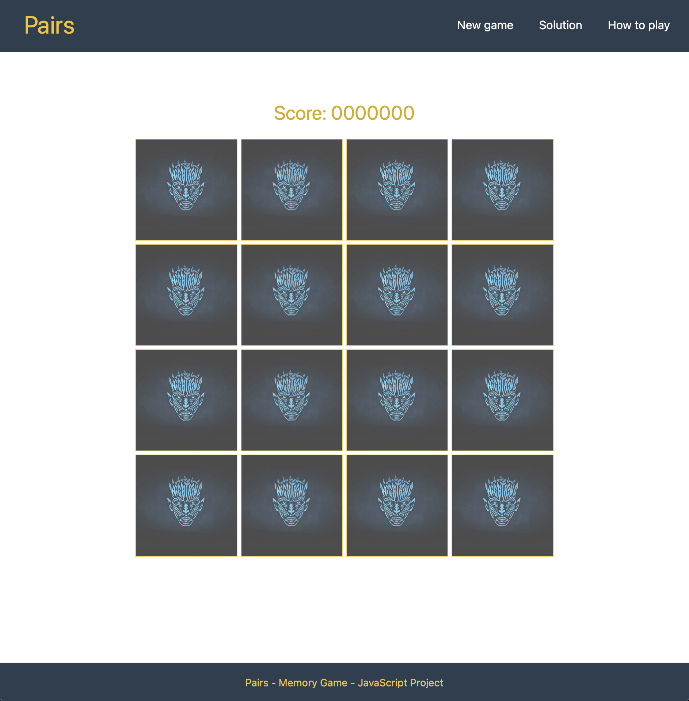

# Pairs - Memory Game

<p align="center">
  
</p>


- Live Demo: Please click [HERE](https://renato79.github.io/Pairs/) to play!

Pairs is a classic game that I created to demostrate my skills in pure, clean and simple (vanilla) JavaScript.

The game presents a main page with the board game, and three links: How to play, Solution (To see the solution of the current game) and New Game.

The score is based on a timer, then you can improve your score at any time you play again.

## Technologies Used
- HTML5
- CSS3 (Responsive)
- [Bootstrap 5](https://getbootstrap.com/docs/5.0/getting-started/introduction/)
- JavaScript
- DOM (Document Object Model)

### Code validation
- I checked the markup validity of my Web documents in HTML on [The Markup Validation Service](https://validator.w3.org/)
- I validated my CSS code on [The W3C CSS Validation Service](https://jigsaw.w3.org/css-validator/)

## Credits

### Content
- Instructions, in the section "How to play" were obtained at: https://www.classicgamesandpuzzles.com/Memory.html

### Media
- I downloaded the pictures of the actors of Game of Thrones from: https://www.hbo.com/game-of-thrones/cast-and-crew
- I downloaded the picture of the Night King from https://www.peakpx.com

## Deployment

### Git, GitHub and Visual Studio Code
- The [project](https://renato79.github.io/Pairs/) was fully deployed to [GitHub](https://github.com/Renato79/Pairs).
- I used a code editor on my computer, [Visual Studio Code](https://www.visualstudio.com/) for [macOS](https://en.wikipedia.org/wiki/MacOS)
- I used [Git](https://git-scm.com/), the popular version control system.

### Forking the GitHub Repository

By forking the GitHub Repository we make a copy of the original repository on our GitHub account to view and/or make changes without affecting the original repository by using the following steps...

1. Log in to GitHub and locate the [GitHub Repository](https://github.com/Renato79/Pairs)
2. At the top of the Repository (not top of page) just above the "Settings" Button on the menu, locate the "Fork" Button.
3. You should now have a copy of the original repository in your GitHub account.

### Making a Local Clone

1. Log in to GitHub and locate the [GitHub Repository](https://github.com/Renato79/Pairs)
2. Under the repository name, click "Clone or download".
3. To clone the repository using HTTPS, under "Clone with HTTPS", copy the link.
4. Open Git Bash
5. Change the current working directory to the location where you want the cloned directory to be made.
6. Type `git clone`, and then paste the URL you copied in Step 3.

```
$ git clone https://github.com/Renato79/Pairs/
```

7. Press Enter. Your local clone will be created.

```
$ git clone https://github.com/Renato79/Pairs/
> Cloning into `CI-Clone`...
> remote: Counting objects: 10, done.
> remote: Compressing objects: 100% (8/8), done.
> remove: Total 10 (delta 1), reused 10 (delta 1)
> Unpacking objects: 100% (10/10), done.
```

Click [Here](https://help.github.com/en/github/creating-cloning-and-archiving-repositories/cloning-a-repository#cloning-a-repository-to-github-desktop) to retrieve pictures for some of the buttons and more detailed explanations of the above process.